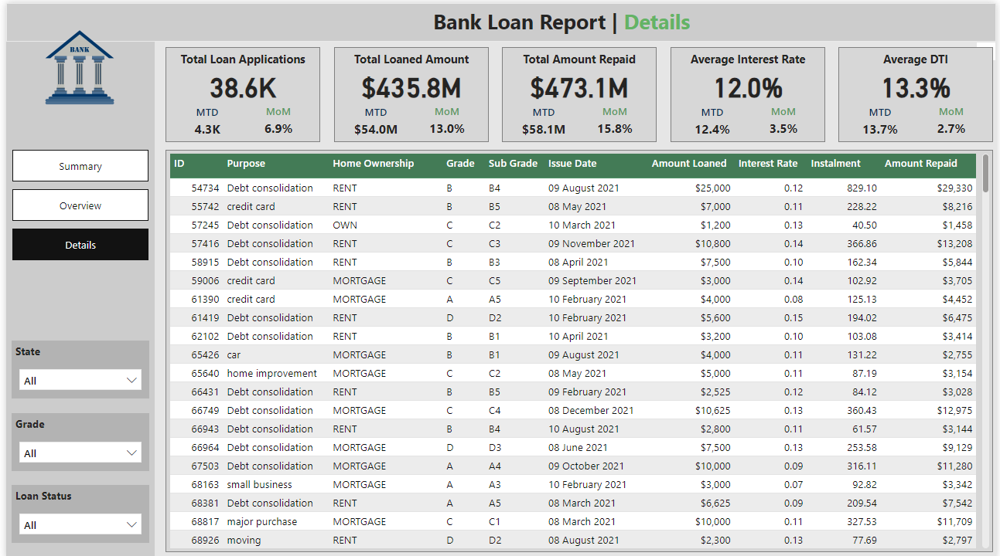

# BankLoanProject

# Objective

* Key objectives for this project

The bank aims to gain a deeper understanding of the loans they have issued. By conducting a comprehensive analysis of these loans, they seek to uncover valuable insights that will support more informed and strategic business decisions.
